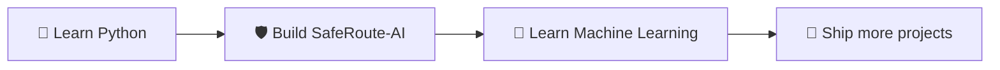

<!-- ================= BANNER ================= -->

  

<!-- ================= TYPING ANIMATION ================= -->

  

<!-- ================= BADGES ================= -->

  
  
  

  

---

## 👋 About Me

I'm a 3rd year **BTech CSE (AI & Data Science)** student who loves the idea of building things that actually help people. I'm learning Python step by step and putting my projects here as I go.

- 🔭 Currently building **SafeRoute-AI**, an AI system that suggests safer routes
- 🌱 Currently learning **Python**, **Git** and **GitHub**
- 🎯 Goal: build real AI projects that solve real problems
- 💬 Ask me about: starting out in tech, Python, AI

---

## 🛠️ Tech Stack

**Using now**

  

**Learning next**

  

---

## 🚀 Featured Project

<table>
  <tr>
    <td>
      <h3>🛡️ SafeRoute-AI</h3>
      
An AI-based safer route recommendation system that uses <b>crime risk</b>, <b>police proximity</b> and <b>hospital proximity</b> to suggest safer paths.

      

        
        
      

      
    </td>
  </tr>
</table>

---

## 🗺️ My Journey

---

## 📊 GitHub Stats

  
  

  

> The stats start small and grow as I commit more code.

---

## 🤝 Connect

  

<i>⭐ Thanks for stopping by. Let's build something great.</i>

