# 💫 About Me:

👩‍💻 Hi, I'm **Kusuma Sai Reddy**, a B.Tech student specializing in Artificial Intelligence & Data Science.

I’m passionate about technology, problem-solving, and continuously improving my skills in Python, Data Science, Machine Learning, SQL, Cloud, and Software Development.

I enjoy learning how real-world systems work, exploring new technologies, and building a strong foundation in both programming and data-driven problem solving.

🎯 My goal is to grow into a skilled AI/Data professional and software engineer, contribute to meaningful technology, and work on challenging real-world problems.

🌱 **Currently focused on:**
- Strengthening Python and DSA
- Improving SQL and database skills
- Learning Machine Learning concepts
- Exploring Cloud and backend technologies
- Building stronger problem-solving and development skills

💡 **Interests:**
Artificial Intelligence • Data Science • Machine Learning • Python • Cloud • Software Development

## 🌐 Socials:

 

# 💻 Tech Stack:

**🧠 Languages** 
    

**⚙️ Backend & Deployment** 
  

**🗄️ Databases** 
 

**🛠️ Tools** 
  

<!-- Proudly created with GPRM ( https://gprm.itsvg.in ) -->
